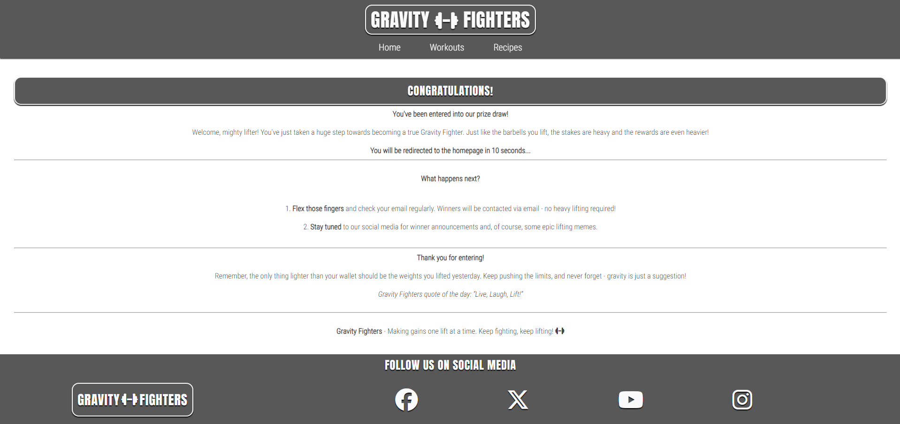

# [GRAVITY FIGHTERS](https://ash-5p.github.io/Gravity-Fighters)

---

This project is a static website to promote a weightlifting club called "Gravity Fighters". It provides information about the different types of weightlifting to people who are interested in getting into the sport/hobby, and will emphasize the difference between the training styles and outcomes of each. There is a page of example workouts to try for each type of lifting, and a page offerening high-protein meal recipes with nutritional information. Gravity Fighters website's main goal is to introduce people to the club and encourage everyone from beginner to advanced lifter to try the different lifting sports.

Click the below link to view the site on Am I Responsive:
https://ui.dev/amiresponsive?url=https://ash-5p.github.io/Gravity-Fighters

source: [amiresponsive](https://ui.dev/amiresponsive?url=https://ash-5p.github.io/Gravity-Fighters)

## UX

The color scheme and blocky header fonts were chosen to give the site a slightly gritty/serious feel akin to the weightlifitng imagery used throughout the site. The text font for the headers was directly inspired by my favorite gym from my hometown, [True Grit Training](https://www.truegrittraining.co.uk/).

### Colour Scheme

The dark grey tones were chosen for the header and footer to emulate the dark gritty asthetic seen in a lot of weightlifting imagery, like the hero image on the homepage. White text was then chosen to contrast the dark colors for a better user experience.
These colors were then inverted for the main section of each page, as the images popped better on a white background.

- `#444444` used for primary text.
- `#FAFAFA` used for primary highlights.
- `#FAFAFA` used for secondary text.
- `#585858` used for secondary highlights.

I used [coolors.co](https://coolors.co/fafafa-585858-444444) to generate my colour palette.

### Typography

- [Anton SC](https://fonts.google.com/specimen/Anton+SC?query=anton+sc)was used for all headings and the site logo, as the large block letters was inkeeping with the theme of strength.

- [Roboto Condensed](https://fonts.google.com/specimen/Roboto+Condensed?query=roboto+co) was used for all other secondary text.

- [Font Awesome](https://fontawesome.com) icons were used throughout the site, such as the social media icons in the footer, and the dumbell icon in the site logo and navbar.

## Features

### Existing Features

- **Header**

    - The header houses the site logo and navbar, and is fixed to ensure these features are always visible to the user no matter where they are on the current page.

- **Gravity Fighters Logo**

    - The Gravity Fighters logo immediately draws attention due to the box-shadow effect which gives it a 3D appearence. The dumbell icon lets the user know that Gravity Fighters is a weightlifting focused website. 

 

- **Navbar**

    - The navbar provides the main means to navigate the whole site. This is attached to a fixed header, allowing user to switch between each page without having to scroll back to the top of the current page. The currently selected page with be indicated by a dumbell icon on the navbar.

- **Footer**

    - The footer houses another logo and all of the links to the Gravity Fighters social media pages. It serves as an indicator to the user that they have reached the bottom of the page and there is no more content below.

- **Social Media Icons**

    - The social media icons, housed in the footer, act as links to the corresponding Gravity Fighters social media pages.

- **Homepage**

    - The homepage serves as a landing point for the user and makes it immediately apparent what the site is about. It contains a hero image of a person preparing to perform a lift, and an introduction into what/who Gravity Fighters are. It also contains an overview of the types of weightlifting.

- **Types of Weightlifting Section**

    - This section provides a brief summary and a visual representation of the different types of weightlifting, allowing the user to compare them to see which format would interest them the most. Sections of the text containing key words contain links to their corrisponding wikipedia pages to encourage the user to research deeper.

- **Workouts Page**

    - The workouts page offers a selection of sample workouts for each of the different types of lifting talked about on the homepage. This allows users to try out each style to see whch one best suits them.

- **Workouts Summary/Detail**

    - The workouts on the workouts page are displayed using the summary/detail elements, which allow the only workout name to be shown initially until clicked on, and will then extend to reveal the full workout. This feature serves to make the page less cluttered, producing a positive response from the user, and making it obvious that their is more content below.

 

- **Recipes Page**

    - The recipes page offers a selection of sample recipes to the user. It has its own navigation bar local to the recipes page which allows easy navigation to the desired recipe, and also contains a form to be completed by the user to enter a prize draw.

 

- **Recipes Page Navbar**

    - The recipes page navbar allows the user to quickly navigate to the desired recipe, and prompts them to enter the prize draw with a competition navigation button. The nav buttons feature a background image of the recipe they navigate to which acts as a visual preview for the user, these images zoom in on hover.   

- **Competition Form**

    - The competition form allows the user to enter a prize draw to win a years supply of protein suppliments. It consists of first name, surname, email and favourite recipe (select) fields, and requires all fields to be filled to allow submission, and takes the user to a confirmation page.

- **Competition Form Confrimation Page**

    - This page allows the user to know that they have submitted the form correctly and entered the competition. It automatically redirects the user to the homepage after 20 seconds.

- **Error 404 Page**

    - The custom error 404 page is inkeeping with the theme of the website, and uses humor to reduce the negative feeling of encountering an error. This offers a more positive response from the user than a generic 404 page.

### Future Features

- Extend Recipes Section
    - Due to time constraints I only added 4 recipes to the this section, however I plan to add more in the future.

- Macro Calculator
    - I plan to add another page containing a macro calculator and an overview which will explain the benefits of tracking macros. I currently don't possess the knowledge/skill to do this, so I plan to implement this when I have progressed further in the code institute fullstack development course.

## Tools & Technologies Used

-  used to generate README and TESTING templates.
-  used for version control. (`git add`, `git commit`, `git push`)
-  used for secure online code storage.
-  used as a cloud-based IDE for development.
-  used for the main site content.
-  used for the main site design and layout.
-  used for hosting the deployed front-end site.
-  used as the front-end CSS framework for modern responsiveness and pre-built components.
-  used for creating wireframes.
-  used for the icons.
-  used to help debug, troubleshoot, explain things, and generate text for 404 and confirmation pages.

## Testing

> [!NOTE]  
> For all testing, please refer to the [TESTING.md](TESTING.md) file.

## Deployment

The site was deployed to GitHub Pages. The steps to deploy are as follows:

- In the [GitHub repository](https://github.com/Ash-5p/Gravity-Fighters), navigate to the Settings tab 
- From the source section drop-down menu, select the **Main** Branch, then click "Save".
- The page will be automatically refreshed with a detailed ribbon display to indicate the successful deployment.

The live link can be found [here](https://ash-5p.github.io/Gravity-Fighters)

### Local Deployment

This project can be cloned or forked in order to make a local copy on your own system.

#### Cloning

You can clone the repository by following these steps:

1. Go to the [GitHub repository](https://github.com/Ash-5p/Gravity-Fighters) 
2. Locate the Code button above the list of files and click it 
3. Select if you prefer to clone using HTTPS, SSH, or GitHub CLI and click the copy button to copy the URL to your clipboard
4. Open Git Bash or Terminal
5. Change the current working directory to the one where you want the cloned directory
6. In your IDE Terminal, type the following command to clone my repository:
	- `git clone https://github.com/Ash-5p/Gravity-Fighters.git`
7. Press Enter to create your local clone.

Alternatively, if using Gitpod, you can click below to create your own workspace using this repository.

Please note that in order to directly open the project in Gitpod, you need to have the browser extension installed.
A tutorial on how to do that can be found [here](https://www.gitpod.io/docs/configure/user-settings/browser-extension).

#### Forking

By forking the GitHub Repository, we make a copy of the original repository on our GitHub account to view and/or make changes without affecting the original owner's repository.
You can fork this repository by using the following steps:

1. Log in to GitHub and locate the [GitHub Repository](https://github.com/Ash-5p/Gravity-Fighters)
2. At the top of the Repository (not top of page) just above the "Settings" Button on the menu, locate the "Fork" Button.
3. Once clicked, you should now have a copy of the original repository in your own GitHub account!

### Local VS Deployment

There are no notable differences between the local and deployed site.

## Credits

### Content

| Source | Location | Notes |
| --- | --- | --- |
| [Markdown Builder](https://tim.2bn.dev/markdown-builder) | README and TESTING | tool to help generate the Markdown files |
| [Chris Beams](https://chris.beams.io/posts/git-commit) | version control | "How to Write a Git Commit Message" |
| [W3Schools](https://www.w3schools.com/howto/howto_js_topnav_responsive.asp) | entire site | responsive HTML/CSS/JS navbar |
| [BBCgoodFOOD](https://www.bbcgoodfood.com/recipes/protein-pancakes-with-banana) | recipes.html | protein pancakes with bannana recipe |
| [BBCgoodFOOD](https://www.bbcgoodfood.com/recipes/steak-burrito-bowl) | recipes.html | steak burrito bowl recipe |
| [BBCgoodFOOD](https://www.bbcgoodfood.com/recipes/steak-burrito-bowl) | recipes.html | vegan spinach omelette recipe | 
| [Maxi Nutrition](https://www.maxinutrition.com/training/plans/Powerlifting-Training-Plan/) | workouts.html | content for powerlifting workouts (Benchpress/Deadlift/Squat)|
| [TrainHeroic](https://www.trainheroic.com/blog/olympic-weightlifting-program/) | workouts.html | content for olympic weightlifting workouts (Day1/Day2/Day3/Day4)|
| [Healthline](https://www.healthline.com/health/fitness/one-rep-max-how-to-calculate-and-use#how-to-calculate) | workouts.html | content of powerlifting workouts (1RM Test) |
| [w3schools](https://www.w3schools.com/css/css_list.asp) | 404.html & confirmation.html | list-style-position: inside;  |
| [Code Institute](https://github.com/Code-Institute-Solutions/love-running-v3/blob/main/8.1-testing-and-validation/index.html#L24-L39) | entire site | used as guide for header html structure|
| [Code Institute](https://github.com/Code-Institute-Solutions/love-running-v3/blob/main/8.1-testing-and-validation/assets/css/style.css#L32-L43) | entire site | used as guide for header css styling |
| [Code Institute](https://github.com/Code-Institute-Solutions/love-running-v3/blob/main/8.1-testing-and-validation/index.html#L132-L155) | entire site | used as guide for footer html structure |
| [Code Institute](https://github.com/Code-Institute-Solutions/love-running-v3/blob/main/8.1-testing-and-validation/assets/css/style.css#L256-L262) | entire site | used as guide for footer css styling |

### Media

| Source | Location | Type | Notes |
| --- | --- | --- | --- |
| [Alpha Coders](https://images6.alphacoders.com/100/thumb-1920-1001192.jpg) | index.html| image | hero image |
| [Alpha Coders](https://images.alphacoders.com/107/thumb-1920-1076955.jpg) | index.html| image | Bodybuilder Image (bodybuilder.webp) |
| [furrloveov](https://wallpapers.com/images/hd/man-with-large-muscles-weight-lifting-00g0gqx7ucmdosro.jpg) | index.html| image | Powerlifter Image (powerlifter.webp) |
| [Wallpapers.com](https://wallpapers.com/images/hd/passionate-fitness-junkie-weight-lifting-4hpw4d9d9k0ljvos.jpg) | index.html| image | Weightlifter Image (olympic-weightlifter.webp) |
| [Salt&Baker](https://saltandbaker.com/wp-content/uploads/2021/10/Chocolate-Peanut-Butter-Protein-Oatmeal-5.jpg) | recipes page | image | image of chocolate peanut butter protein overnight oats | 
| [Freepik](https://img.freepik.com/free-photo/almond-banana-pancake_1339-5262.jpg?t=st=1720985120~exp=1720988720~hmac=0fae57946d909be03ce08a276a2308b00d846f39943b90f0a29031618e84a6b5&w=996) | recipes page | image | image of pancakes with bannana |
| [BBCgoodFOOD](https://images.immediate.co.uk/production/volatile/sites/30/2020/08/steak-burrito-bowl-932949f.jpg?quality=90&webp=true&resize=375,341) | recipes.html | image | image of steak burrito bowl|
| [BBCgoodFOOD](https://images.immediate.co.uk/production/volatile/sites/30/2023/05/Spinach-Omelette440x400-1c259f3.jpg?quality=90&webp=true&resize=375,341) | recipes.html | image | image of vegan spinach omelette |
| [Image Resizer](https://imageresizer.com/image-compressor/editor) | recipes.html | image | used to compress image size of protein pancakes |

### Acknowledgements

- I would like to thank my Code Institute mentor, [Tim Nelson](https://github.com/TravelTimN) for his support throughout the development of this project.
- I would like to thank the [Code Institute](https://codeinstitute.net) tutor team for their assistance with troubleshooting and debugging some project issues.
- I would like to thank the [Code Institute Slack community](https://code-institute-room.slack.com) for the moral support; it kept me going during periods of self doubt and imposter syndrome.
- I would like to thank my partner (Lorna), for believing in me, and allowing me to make this transition into software development.
